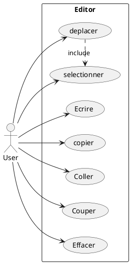
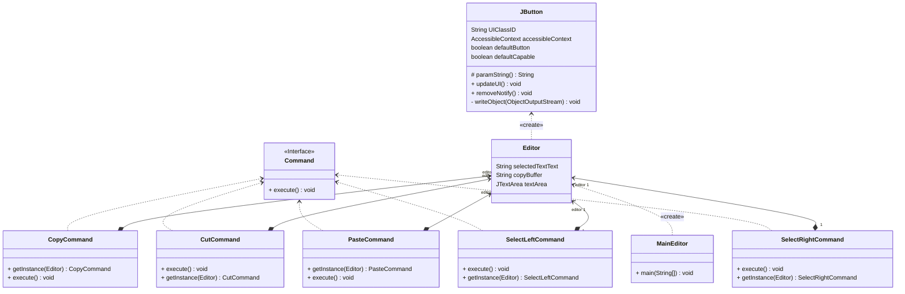
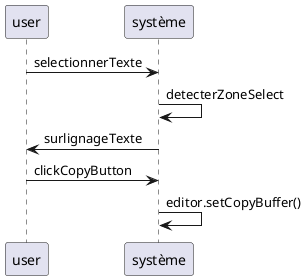
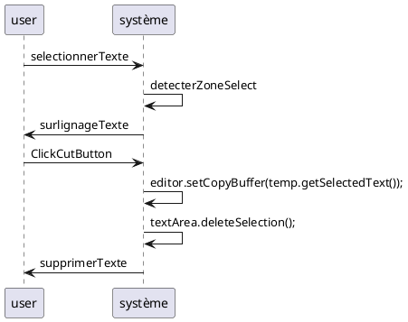
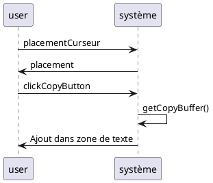
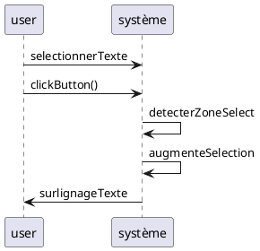

# OMD - TP2 - Conception Orientée Objet - Mini-Editeur

# Auteurs: Aubry TONNERRE et Thibault GUERINEL

# Date: 23/10/2023

---

L'objectif de ce TP est de concevoir un éditeur en Java en utilisant un pattern de conception adapté.

Pour des raisons de simplicité, nous avons décidé de faire un éditeur de texte en utilisant Swing mais en implémentant notre propre presse papier.

Dans une première version, nous avons implémenté une version de l'éditeur qui prend en charge les commandes de base (copier, coller, couper, selectionner) et qui donne à l'utilisateur la possibilité d'écrire son texte dans une zone.

Dans une deuxième version, nous avons implémenté une version de l'éditeur qui prend en charge les mêmes commandes que la première version mais qui permet aussi de faire des undo/redo avec l'implémentation d'un historique de commande.

## Organisation du projet

Le projet est organisé en 2 packages principaux:

- v1 - contient la première version de l'éditeur qui à pour objectif de mettre en place le pattern de conception.
- v2 - contient la seconde version de l'éditeur qui à pour objectif de gerer en plus les commandes de undo/redo.

## Pattern de conception utilisé - Commande

Le pattern que nous allons utiliser pour faire ce projet est le pattern de conception Commande.

### Diagramme de classe

<figure>

<figcaption align = "center"><b>Fig.1 - Pattern Command from Refactoring Guru.</b></figcaption>
</figure>

Ce diagramme possède un Client qui pour nous représentera l'éditeur de texte. Il possède une interface Command qui permet de définir les méthodes execute() qui sera implémentée par les classes concrètes CopyCommand, CutCommand, PasteCommand, SelectLeftCommand et SelectRightCommand. Ces classes concrètes implémentent les méthodes execute() de l'interface Command.
Un Invoker aura pour objectif d'appeler les méthodes execute() des classes concrètes. Dans notre cas, nous utiliserons les boutons de l'interface Swing pour appeler les méthodes execute() des classes concrètes.
Les command intéragiront directement avec l'éditeur de texte pour effectuer les actions demandées par l'utilisateur.
Voici le diagramme de use case de notre éditeur:



## Presentation de l'éditeur v1

### Arborecence du projet

```
├── src
│   ├── v1
│   │   ├── Command.java
│   │   │── CopyCommand.java
│   │   │── CutCommand.java
│   │   │── Editor.java
│   │   │── MainEditor.java
│   │   │── PasteCommand.java
│   │   │── SelectLeftCommand.java
│   │   │── SelectRightCommand.java
└── UMLDiag
│   ├── v1
└── .gitignore
```

### Diagramme UML 



Nous avons décidé de créer unn classe Editor avec le framework Swing qui donnera à l'utilisateur un accès à une zone de texte (JTextArea) 
ainsi qu'à un ensemble de bouton executant les actions voulus par l'utilisateur.

Pour rappel, l'objectif est de donnée à un utilisateur une zone de texte et des commandes à éxécuter. Nous avons décidé 
d'éxécuter les commandes en utilisants des boutons (JButton). Chaque commandes hérite d'une interface Command qui possède 
une méthode execute() qui sera implémentée par les classes concrètes CopyCommand, CutCommand, PasteCommand, SelectLeftCommand et SelectRightCommand.


#### Execution CopyCommand



#### Execution CutCommand



#### Execution PasteCommand




#### Execution SelectLeftCommand - SelectRightCommand

Il faut noter que dans le cas de la commande SelectRightCommand, la sélection est bien effectué mais sans le surlignage du texte.


## Presentation de l'éditeur v2

### Arborecence du projet


### Diagramme UML


#### Execution Replay
```plantuml

```

#### Execution Redo
```plantuml

```


#### Execution Undo
```plantuml

```


#### Execution historyCommand
```plantuml

```