@startuml
'https://plantuml.com/sequence-diagram
user -> système: selectionnerTexte
système -> système: detecterZoneSelect
système -> user: surlignageTexte
user -> système: clickCopyButton
système -> système: CopyCommand.execute()
@enduml# OMD - TP2 - Conception Orientée Objet - Mini-Editeur

# Auteurs: Aubry TONNERRE et Thibault GUERINEL

# Date: 23/10/2023

---

L'objectif de ce TP est de concevoir un éditeur en Java en utilisant un pattern de conception adapté.

Pour des raisons de simplicité, nous avons décidé de faire un éditeur de texte en utilisant **Swing** mais en implémentant notre propre presse papier.

Dans une première version, nous avons implémenté une version de l'éditeur qui prend en charge les commandes de base (copier, coller, couper, selectionner) et qui donne à l'utilisateur la possibilité d'écrire son texte dans une zone.

Voici le diagramme de use case de notre éditeur:

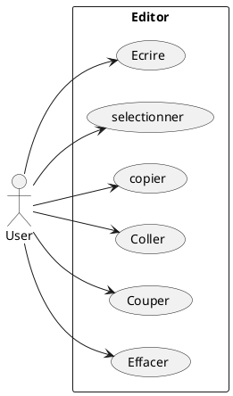

Dans une deuxième version, nous avons implémenté une version de l'éditeur qui prend en charge les mêmes commandes que la première version mais qui permet aussi de faire des undo/redo avec l'implémentation d'un historique de commande.

## Organisation du projet

Le projet est organisé en 2 packages principaux:

- v1 - contient la première version de l'éditeur qui à pour objectif de mettre en place le pattern de conception.
- v2 - contient la seconde version de l'éditeur qui à pour objectif de gerer en plus les commandes de undo/redo.

## Pattern de conception utilisé - Commande

Le pattern que nous allons utiliser pour faire ce projet est le pattern de conception Commande.

### Diagramme de classe

<figure>

<figcaption align = "center"><b>Fig.1 - Pattern Command from Refactoring Guru.</b></figcaption>
</figure>

Le diagramme comprend un Client représentant un éditeur de texte, avec une interface Command définissant des méthodes execute()
implémentées par des classes concrètes telles que CopyCommand, CutCommand, PasteCommand, SelectLeftCommand et SelectRightCommand.
Un Invoker est chargé d'appeler les méthodes execute() des classes concrètes, et dans ce contexte, des boutons Swing servent de déclencheurs pour ces commandes,
simplifiant ainsi l'interaction de l'utilisateur. Les commandes agissent directement sur l'éditeur de texte pour effectuer des actions spécifiques.
L'utilisation du modèle de conception de Command permet d'introduire de nouvelles commandes de manière modulaire et de les invoquer via des boutons d'interface utilisateur,
offrant la flexibilité nécessaire pour développer un éditeur de texte capable d'exécuter diverses actions.

## Presentation de l'éditeur v1

### Arborecence du projet

```
├── src
│   ├── v1
│   │   ├── Command.java
│   │   │── CopyCommand.java
│   │   │── CutCommand.java
│   │   │── Editor.java
│   │   │── MainEditor.java
│   │   │── PasteCommand.java
│   │   │── SelectLeftCommand.java
│   │   │── SelectRightCommand.java
└── UMLDiag
│   ├── v1
└── .gitignore
```

### Diagramme UML

A l'aide du pattern que nous avons choisi, nous avons pu réaliser le diagramme de classe suivant:

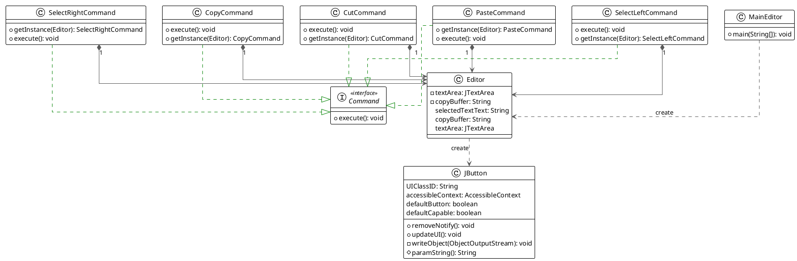

Nous avons décidé de créer unn classe Editor avec le framework Swing qui donnera à l'utilisateur un accès à une zone de texte (JTextArea)
ainsi qu'à un ensemble de bouton (Jbuttun) executant les actions voulus par l'utilisateur.

Pour rappel, l'objectif est de donnée à un utilisateur une zone de texte et des commandes à éxécuter. Nous avons décidé
d'éxécuter les commandes en utilisants des boutons (JButton). Chaque commandes hérite d'une interface Command qui possède
une méthode execute() qui sera implémentée par les classes concrètes CopyCommand, CutCommand, PasteCommand, SelectLeftCommand et SelectRightCommand.

Maintenant que nous avons définie la structure générale du projet, nous allons faire le tour de chaque class et décrire leur comportement à travers des diagrammes de séquance.

#### Execution CopyCommand

Pour commencer, nous allons traiter le cas de **CopyCommand**.

Nous avons déterminer que pour qu'un utilisateur puisse copier un élément, l'utilisateur doit pour commencer sélectionner dans l'editeur le texte à copier. Comme tout éditeur, le texte sera surligné. Une fois que la sélection satisfait l'utilisateur il n'as plus qu'à cliquer sur le bouton "Copie" et la command execute() de CopyCommand s'éxécutera en actualisant le copyBuffer (presse papier) de l'éditeur. Si toutefois l'utilisateur clique sur le bouton copy sans sélectionner un élément, le copyBuffer stockera donc une chaine de caractère vide.

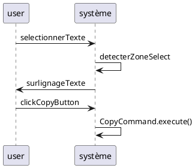

#### Execution CutCommand

Poursuivons par le traitement de **CutCommand**.

Nous avons déterminé que pour qu'un utilisateur puisse couper un élément, il doit pour commencer sélectionner dans l'editeur le texte à couper. Comme tout éditeur, le texte sera surligné. Une fois que la sélection satisfait l'utilisateur il n'as plus qu'à cliquer sur le bouton "Couper" et la command execute() de CutCommand s'éxécutera en actualisant le copyBuffer (presse papier) de l'éditeur et en supprimant le texte sélectionné.
Si toutefois l'utilisateur clique sur le bouton cut sans sélectionner un élément, le cutBuffer stockera donc une chaine de caractère vide.

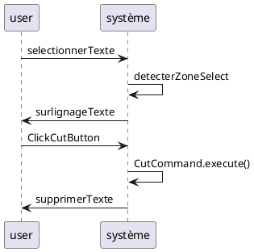

#### Execution PasteCommand

Passons maintenant au traitement de **PasteCommand**.

Nous avons déterminé que pour qu'un utilisateur puisse coller un élément, il doit pour commencer sélectionner dans l'editeur le texte à remplacer. Comme tout éditeur, le texte sera surligné. Une fois que la sélection satisfait l'utilisateur il n'as plus qu'à cliquer sur le bouton "Coller" et la command execute() de PasteCommand s'éxécutera en remplaçant le texte sélectionné par le texte du copyBuffer.
Si toutefois l'utilisateur clique sur le bouton paste sans sélectionner un élément, le texte du copyBuffer sera collé à la position du curseur.

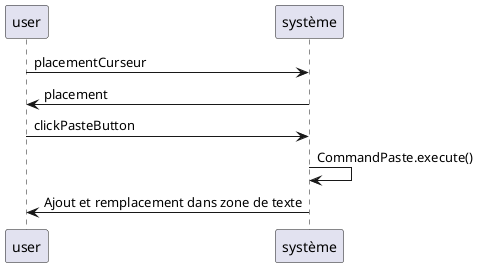

#### Execution SelectLeftCommand - SelectRightCommand

Enfin, nous allons traiter le cas de **SelectLeftCommand** et **SelectRightCommand**.

Nous avons déterminé que pour qu'un utilisateur puisse sélectionner un élément, il doit pour commencer placer le curseur à l'endroit où il souhaite commencer sa sélection. Une fois que la sélection satisfait l'utilisateur il n'as plus qu'à cliquer sur le bouton "<--" ou "-->" et la command execute() de SelectLeftCommand ou SelectRightCommand s'éxécutera en surlignant le texte à gauche ou à droite du curseur.

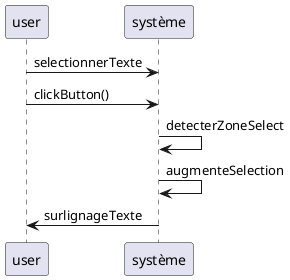

Il faut noter que dans le cas de la commande SelectRightCommand, la sélection est bien effectué mais le surlignage du texte ne s'effectue pas. Ce problème est du à la façon dont swing réagit.

### Rendu final de l'éditeur v1

Voici le rendu final de l'éditeur v1:

<figure>

<figcaption align = "center"><b>Fig.2 - Rendu final de l'éditeur v1.</b></figcaption>
</figure>

## Presentation de l'éditeur v2

### Arborecence du projet
La deuxième version est disposée dans le package v2.
Il est constitué de l'ensemble des classes de la version 1 ainsi que de 3 nouvelles classes:
- CharacterCommand.java
- HistoryCommand.java
- Pair.java

La classe CharacterCommand.java est une classe qui permet de gérer les commandes d'insertion de caractère dans la zone de texte.
Elle implémente l'interfae Command.java.
La classe HistoryCommand.java est une classe qui permet de gérer l'historique des commandes.
La classe Pair.java est une classe qui permet de gérer les paires de commandes pour l'historique.
Nous allons expliquer leur fonctionnement dans la suite grâce à des diagrammes de séquence.


### Diagramme UML
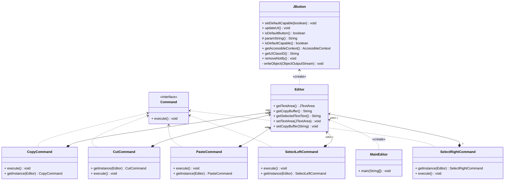
ou le diagrame la ?

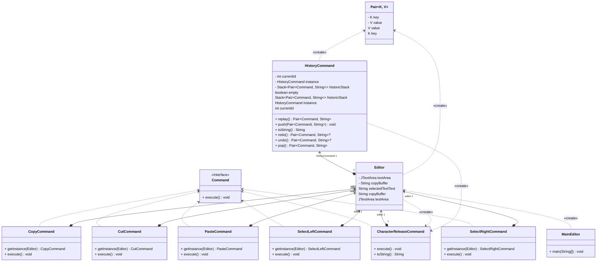
Le diagramme de class de la version 2 est le même que celui de la version 1. Nous ajoutons donc les classes énoncés précédemment.
Nous allons nous intéresser aux méthodes qui les composent.
- CharacterCommand.java :
    - réécris la fonction execute de la classe Command.java pour gérer l'insertion de caractère
      dans la zone de texte.
    - réécris la méthode toString() pour afficher le caractère inséré.
- Pair.java :
    - permet de créer une paire de commande et de texte pour l'historique.
- HistoryCommand.java : Utilise une stack de pair, composé de commande et de texte pour gérer l'historique. Il est composé
  d'une variable currientId qui permet de savoir à quel état de l'historique nous sommes. Nous pouvons ainsi
  aisément avancer ou reculer dans l'historique.
    - push : permet d'ajouter une paire de commande et de texte dans la stack qui sert d'historique.
    - pop : permet de récupérer la dernière paire de commande et de texte de la stack, puis de l'enlever de la stack.
    - undo : permet de retourner à un état précédent de l'éditeur. En décrémentant notre pointeur sur la stack.
    - redo : permet de retourner à un état futur de l'éditeur. En incrémentant notre pointeur sur la stack.
    - replay : permet de rejouer la dernière commande effectuée.


#### Execution Replay
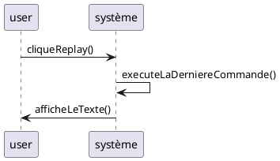
L'objectif est de récupérer la dernière commande, et de rééfectuer son exécution. L'utilisateur n'a rien à faire,
il clique sur le bouton replay et la dernière commande est rééxecutée.

#### Execution Redo
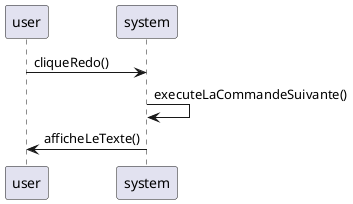
L'objectif est de récupérer la commande suivante, et de replacer le texte à cette état. L'utilisateur n'a rien à faire,
il clique sur le bouton redo. Le curseur est ainsi déplacé à l'itération suivante.

#### Execution Undo
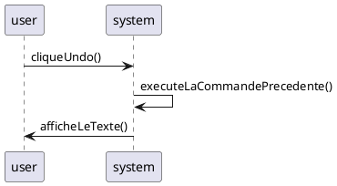
L'objectif est de récupérer la commande précédente, et de replacer le texte à cette état. L'utilisateur n'a rien à faire,
il clique sur le bouton undo. Le curseur est ainsi déplacé à l'itération précédente.