# OMD - TP2 - Conception Orientée Objet - Mini-Editeur

# Auteurs: Aubry TONNERRE et Thibault GUERINEL

# Date: 23/10/2023

**Note :** Il est important de noter que nous avons intégré le **dossier de conception** et le **dossier de développeur** dans cet unique fichier **Readme**.
Nous trouvions qu'en termes de lecture, il était plus facile de le lire dans sa continuité.

L'objectif de ce TP est de concevoir un éditeur en Java en utilisant un pattern de conception adapté.

Pour des raisons de simplicité, nous avons décidé de faire un éditeur de texte en utilisant **Swing** mais en implémentant notre propre presse-papier.

Dans une première version, nous avons implémenté une version de l'éditeur qui prend en charge les commandes de base (copier, coller, couper, sélectionner) et qui donne à l'utilisateur la possibilité d'écrire son texte dans une zone.

Voici le diagramme de use case de notre éditeur :


<figure>
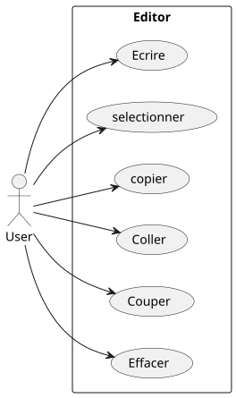
<figcaption align = "center"><b>Fig.1 - Use Case V1.</b></figcaption>
</figure>

Dans une deuxième version, nous avons implémenté une version de l'éditeur qui prend en charge les mêmes commandes que la première version, mais qui permet aussi de faire des undo/redo avec l'implémentation d'un historique de commande ainsi que d'une fonction pour rejouer la dernière action effectuée.

<figure>
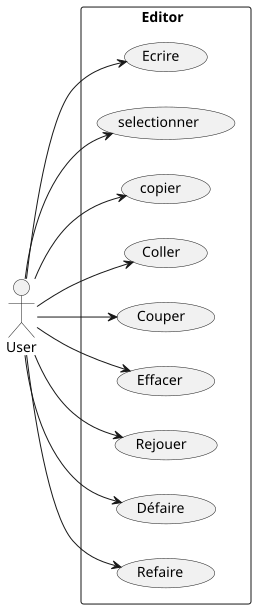
<figcaption align = "center"><b>Fig.2 - Use Case V1.</b></figcaption>
</figure>

## Organisation du projet

Le projet est organisé en 2 packages principaux :

| V1 | Contient la première version de l'éditeur qui a pour objectif de mettre en place le pattern de conception.          | :white_check_mark: |
|----|---------------------------------------------------------------------------------------------------------------------|--------------------|
| V2 | Contient la seconde version de l'éditeur qui a pour objectif de gérer en plus les commandes de undo/redo et replay. | :white_check_mark: |

## Pattern de conception utilisé - Commande

Le pattern que nous allons utiliser pour faire ce projet est le **pattern de conception Commande**.

### Diagramme de classe

<figure>
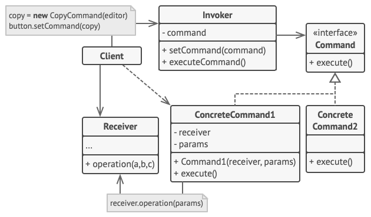
<figcaption align = "center"><b>Fig.3 - Pattern Command from Refactoring Guru.</b></figcaption>
</figure>

Le pattern comprend un Client représentant un éditeur de texte, avec une interface Command définissant des méthodes execute()
implémentées par des classes concrètes telles que la possibilité de faire des copies, du collage...
Un Invoker est chargé d'appeler les méthodes execute() des classes concrètes, et dans ce contexte, des boutons Swing servent de déclencheurs pour ces commandes,
simplifiant ainsi l'interaction de l'utilisateur. Les commandes agissent directement sur l'éditeur de texte pour effectuer des actions spécifiques.
L'utilisation du modèle de conception de Command permet d'introduire de nouvelles commandes de manière modulaire et de les invoquer via des boutons d'interface utilisateur, offrant la flexibilité nécessaire pour développer un éditeur.
Nous en avons donc déduit que ce pattern correspondait à nos besoins, car il permettait d'encapsuler nos fonctionnalités.

## Presentation de l'éditeur v1

### Arborecence du projet

```
├── src
│   ├── v1
│   │   ├── Command.java
│   │   │── CopyCommand.java
│   │   │── CutCommand.java
│   │   │── Editor.java
│   │   │── MainEditor.java
│   │   │── PasteCommand.java
│   │   │── SelectLeftCommand.java
│   │   │── SelectRightCommand.java
│   ├── v2
└── UMLDiag
│   ├── v1
│   │   ├── ClassDiagram.puml
│   │   ├── SequenceColler.puml
│   │   ├── SequenceCopier.puml
│   │   ├── SequenceCouper.puml
│   │   ├── SequenceDéplacer.puml
│   │   ├── SequenceEcrire.puml
│   │   ├── SequenceEffacer.puml
│   │   ├── SequenceSelectionner.puml
│   │   ├── SequenceSelectRightLeft.puml
│   │   ├── UseCase.puml
│   ├── v2
└── .gitignore
```

### Diagramme UML

A l'aide du pattern que nous avons choisi, nous avons pu réaliser le diagramme de classe suivant :

<figure>
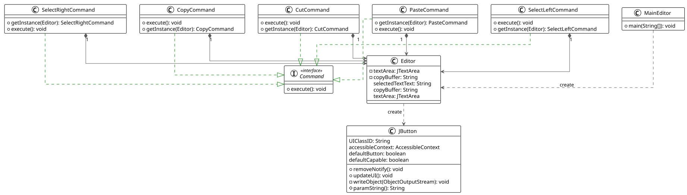
<figcaption align = "center"><b>Fig.4 - Diagram Class V1.</b></figcaption>
</figure>


Nous avons décidé de créer une classe Editor avec le framework Swing qui donnera à l'utilisateur un accès à une zone de texte (JTextArea)
ainsi qu'à un ensemble de bouton (Jbuttun) exécutant les actions voulues par l'utilisateur.

Pour rappel, l'objectif est de donner à un utilisateur une zone de texte et des commandes à exécuter. Nous avons décidé
d'exécuter les commandes en utilisant des boutons (JButton). Chaque commande implémente une interface Command qui possède
une méthode execute() qui sera implémentée par les classes concrètes CopyCommand, CutCommand, PasteCommand, SelectLeftCommand et SelectRightCommand.

L'ensemble des commandes sont construit en suivant un partern singleton. Nous avons fait ce choix, car nous avons déterminé que plusieurs commandes exécutaient le même comportement et que cela pouvait être couteux en mémoire de régénéré à chaque fois un nouvel objet alors que si à chaque fois, on rappelle juste l'instance de la commande, c'est moins couteux.

Maintenant que nous avons définie la structure générale du projet, nous allons faire le tour de chaque classe et décrire leur comportement à travers des diagrammes de séquence.

#### Execution CopyCommand

Pour commencer, nous allons traiter le cas de **CopyCommand**.

Nous avons déterminé que pour qu'un utilisateur puisse copier un élément, il doit pour commencer sélectionner dans l'éditeur le texte à copier. Comme tout éditeur, le texte sera surligné. Une fois que la sélection satisfait l'utilisateur, il n'a plus qu'à cliquer sur le bouton "Copy" et la commande execute() de CopyCommand s'exécutera en actualisant le copyBuffer (presse-papier) de l'éditeur. Si toutefois l'utilisateur clique sur le bouton "Copy" sans sélectionner un élément, le copyBuffer stockera donc une chaine de caractère vide.


<figure>
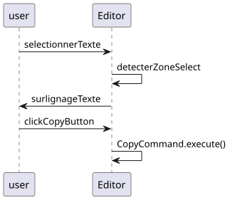
<figcaption align = "center"><b>Fig.5 - Diagram séquence Copy.</b></figcaption>
</figure>


#### Execution CutCommand

Poursuivons par le traitement de **CutCommand**.

Nous avons déterminé que pour qu'un utilisateur puisse couper un élément, il doit pour commencer sélectionner dans l'éditeur le texte à couper. Comme tout éditeur, le texte sera surligné. Une fois que la sélection satisfait l'utilisateur, il n'a plus qu'à cliquer sur le bouton Copy et la command execute() de CutCommand s'éxécutera en actualisant le copyBuffer (presse-papier) de l'éditeur et en supprimant le texte sélectionné.
Si toutefois l'utilisateur clique sur le bouton "Cut" sans sélectionner un élément, le cutBuffer stockera donc une chaine de caractère vide.


<figure>
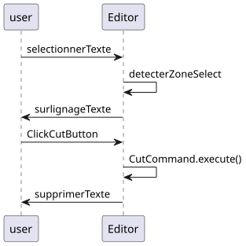
<figcaption align = "center"><b>Fig.6 - Diagram séquence Couper.</b></figcaption>
</figure>


#### Execution PasteCommand

Passons maintenant au traitement de **PasteCommand**.

Nous avons déterminé que pour qu'un utilisateur puisse coller un élément, il doit pour commencer sélectionner dans l'éditeur le texte à remplacer. Comme tout éditeur, le texte sera surligné. Une fois que la sélection satisfait l'utilisateur, il n'a plus qu'à cliquer sur le bouton "Paste" et la commande execute() de PasteCommand s'exécutera en remplaçant le texte sélectionné par le texte du copyBuffer.
Si toutefois l'utilisateur clique sur le bouton "Paste" sans sélectionner un élément, le texte du copyBuffer sera collé à la position du curseur.

<figure>
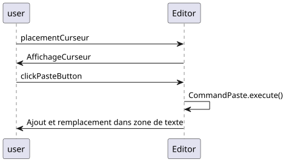
<figcaption align = "center"><b>Fig.7 - Diagram séquence Coller.</b></figcaption>
</figure>


#### Execution SelectLeftCommand - SelectRightCommand

Enfin, nous allons traiter le cas de **SelectLeftCommand** et **SelectRightCommand**.

Nous avons déterminé que pour qu'un utilisateur puisse sélectionner un élément, il doit pour commencer placer le curseur à l'endroit où il souhaite commencer sa sélection. Une fois que la sélection satisfait l'utilisateur, il n'a plus qu'à cliquer sur le bouton "<--" ou "-->" et la commande execute() de SelectLeftCommand ou SelectRightCommand s'exécutera en surlignant un caractère supplémentaire à gauche ou à droite du curseur.

<figure>
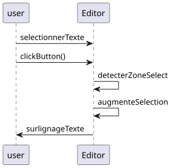
<figcaption align = "center"><b>Fig.8 - Diagram séquence SelectRightLeft.</b></figcaption>
</figure>


**Il faut noter que dans le cas de la commande SelectRightCommand, la sélection est bien effectuée, mais le surlignage du texte ne s'effectue pas. Ce problème est dû à la façon dont swing réagit.**

### Rendu final de l'éditeur v1

Voici le rendu final de l'éditeur v1:

<figure>
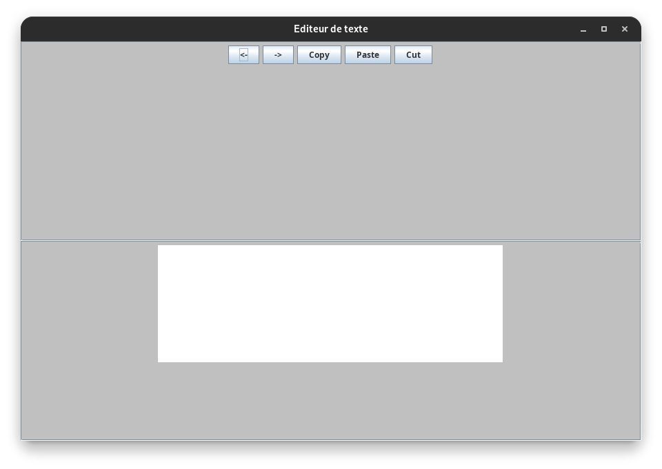
<figcaption align = "center"><b>Fig.9 - Rendu final de l'éditeur v1.</b></figcaption>
</figure>

## Presentation de l'éditeur v2

### Arborecence du projet

```
├── src
│   ├── v1
│   ├── v2
│   │   ├── CharacterRealeseCommand.java
│   │   ├── Command.java
│   │   │── CopyCommand.java
│   │   │── CutCommand.java
│   │   │── Editor.java
│   │   │── HistoryCommand.java
│   │   │── MainEditor.java
│   │   │── Pair.java
│   │   │── PasteCommand.java
│   │   │── SelectLeftCommand.java
│   │   │── SelectRightCommand.java
└── UMLDiag
│   ├── v1
│   ├── v2
│   │   ├── SequenceRedo.puml
│   │   ├── SequenceReplay.puml
│   │   ├── SequenceUndo.puml
└── .gitignore
```

La deuxième version est disposée dans le package v2.
Il est constitué de l'ensemble des classes de la version 1 ainsi que de 3 nouvelles classes :

- CharacterCommand.java
- HistoryCommand.java
- Pair.java

La classe CharacterCommand est une classe qui permet de gérer les commandes d'insertion de caractère dans la zone de texte.
Elle implémente l'interface Command. Nous n'en avions pas besoin à la V1 car nous n'avions pas d'historique à gérer.
La classe HistoryCommand est une classe qui permet de gérer l'historique des commandes.
La classe Pair est une classe qui permet de gérer les paires de commandes pour l'historique.
Nous allons expliquer leur fonctionnement dans la suite grâce à des diagrammes de séquence.
L'ajout de ces classes n'ont pas posé de problème vis-à-vis de l'implémentation de la V1, ces classes agissent comme des fonctionnalités.
Comme notre implémentation est modulaire, nous avons pu les rajouter sans difficultés.

### Diagramme UML

<figure>
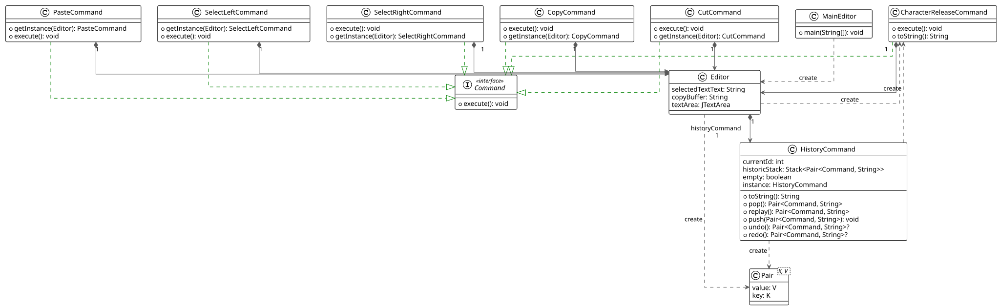
<figcaption align = "center"><b>Fig.10 - Diagram Class V2.</b></figcaption>
</figure>


Le diagramme de classe de la version 2 est le même que celui de la version 1. Nous allons y ajouter les classes présentées précédemment.

Nous allons nous intéresser aux méthodes qui les composent.

- CharacterCommand :
  - réécris la fonction execute de l'interface Command pour gérer l'insertion de caractère
    dans la zone de texte.
- Pair :
  - permet de créer une paire d'éléments qui nous servira pour la gestion de l'historique.
- HistoryCommand : Utilise une stack de pair, composé de Command et d'une String pour gérer l'historique. Il est composé
  d'une variable currientId qui permet de savoir dans quel état de l'éditeur nous sommes. Nous pouvons ainsi
  aisément avancer ou reculer dans l'historique.
  - Voici le détail des fonctions qui compose L'HistoryCommand
    - push : permet d'ajouter une paire de Command et une String dans la stack qui sert d'historique.
    - pop : permet de récupérer la dernière paire de Command et une String de la stack, puis de l'enlever de la stack.
    - undo : permet de retourner à un état précédent de l'éditeur. En décrémentant notre pointeur sur la stack.
    - redo : permet de retourner à un état futur de l'éditeur. En incrémentant notre pointeur sur la stack.
    - replay : permet de rejouer la dernière Command effectuée et l'ajoute dans la stack.

#### Execution Replay

L'objectif est de récupérer la dernière commande, et de réeffectuer son exécution. L'utilisateur n'a rien à faire,
il clique sur le bouton replay et la dernière commande est réexécutée.


<figure>

<figcaption align = "center"><b>Fig.11 - Diagram séquence Rejouer.</b></figcaption>
</figure>


#### Execution Undo

L'objectif est de récupérer la commande précédente, et de replacer le texte à cet état. L'utilisateur n'a rien à faire,
il clique sur le bouton undo. Le curseur est ainsi déplacé à l'itération précédente


<figure>
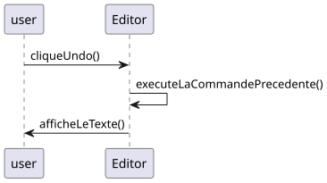
<figcaption align = "center"><b>Fig.12 - Diagram séquence Defaire.</b></figcaption>
</figure>

#### Execution Redo

L'objectif est de récupérer la commande suivante, et de replacer le texte à cet état. L'utilisateur n'a rien à faire,
il clique sur le bouton redo. Le curseur est ainsi déplacé à l'itération suivante.


<figure>
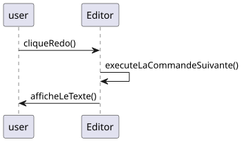
<figcaption align = "center"><b>Fig.13 - Diagram séquence Refaire.</b></figcaption>
</figure>

### Rendu final de l'éditeur v2

Voici le rendu final de l'éditeur v2:

<figure>
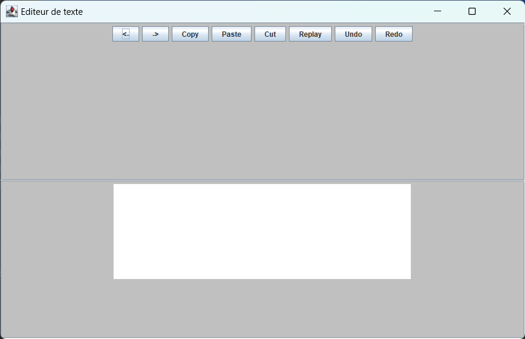
<figcaption align = "center"><b>Fig.14 - Rendu final de l'éditeur v2.</b></figcaption>
</figure>
